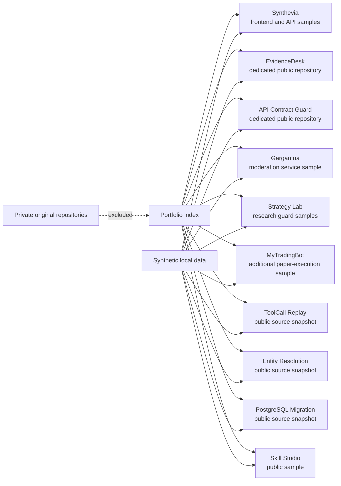

# Ardian Mehaj: Software Engineering Portfolio

I am a junior software developer based in Brussels. I work mainly with Python,
FastAPI, TypeScript, React and PostgreSQL.

This repository brings together ten bounded project stories. Four local samples live here;
five projects link to dedicated public repositories, including clean source snapshots for
ToolCall Replay, Entity Resolution Workbench and PostgreSQL Migration Rehearsal. Examples use
synthetic data and keep their limitations visible.

- [Browse the live portfolio](https://ardian-mehaj-portfolio.vercel.app)
- [Review the complete EvidenceDesk repository](https://github.com/LuxuriantTech/evidencedesk)
- [Review API Contract Guard](https://github.com/LuxuriantTech/api-contract-guard)
- [Review ToolCall Replay](https://github.com/LuxuriantTech/toolcall-replay)
- [Review Entity Resolution Workbench](https://github.com/LuxuriantTech/entity-resolution-workbench)
- [Run the full local verification](scripts/verify_all.sh)

## Projects

| Project | What is reviewable here | Status |
|---|---|---|
| [API Contract Guard](projects/api-contract-guard/README.md) | Dedicated TypeScript CLI repository: five bounded OpenAPI compatibility checks, local reference handling, deterministic JSON/HTML reports and a synthetic demo | Public repository; local-only tool with a defined subset, not a general compatibility verdict |
| [ToolCall Replay](https://github.com/LuxuriantTech/toolcall-replay) | Public source snapshot with local evaluator, synthetic traces and selected tests; browser walkthrough of an expected rejection | Prepared browser result; evaluator runs locally without executing tools |
| [Entity Resolution Workbench](https://github.com/LuxuriantTech/entity-resolution-workbench) | Public source snapshot with local matcher, synthetic catalogues and selected tests; browser explanation of uncertain results | Prepared browser result; similarity is not a probability |
| [EvidenceDesk](projects/evidencedesk/README.md) | Dedicated full-source repository: React/FastAPI application, asynchronous ingestion, hybrid retrieval, pgvector, RBAC, PII masking, audit trail and reproducible evaluation | Experimental local prototype; blind v7 is `HONEST_NEGATIVE` |
| [Synthevia](projects/synthevia/README.md) | React → local FastAPI → in-memory SQLite synthetic record, deterministic retrieval and focused frontend/backend tests | Private product is pre-launch; this edition is offline and not production-ready |
| [PostgreSQL Migration Rehearsal](https://github.com/LuxuriantTech/postgres-migration-rehearsal) | Public source snapshot and guided browser walkthrough of migration checks and rollback evidence | Prepared browser result; local runtime reconstruction is limited |
| [Gargantua / GLXBot](projects/gargantua/README.md) | Asynchronous moderation logic, a rejected member action, a record type without a message-content field and a local API | Historically deployed; current runtime is unverified |
| [Synthevia Strategy Lab](projects/strategy-lab/README.md) | Benjamini–Hochberg p-value adjustment, a compact HAC check, one-use holdout, a declared fill/position sanity gate and deterministic LLM abstention | Internal R&D; synthetic examples only |
| [MyTradingBot](projects/mytradingbot/README.md) | Additional paper-execution sample: live-mode rejection, absolute and configurable equity-relative notional limits and synthetic NO-GO qualification | Paper-only prototype; no live-readiness or profitability claim |
| [Skill Studio](projects/skill-studio/README.md) | Static instruction editor, text diff, Markdown export and documented synthetic evaluation results; model execution remains private | In development; no systematic benefit from additional instructions demonstrated |

The bundled samples keep their own README, decisions, limitations, source and tests.
API Contract Guard also computes a bounded comparison from editable inputs in the browser.
The ToolCall, Entity Resolution and migration browser walkthroughs show prepared synthetic
results; their dedicated public repositories contain reviewable local source and tests.

## Project Atlas navigator

The [Project Atlas site](site/README.md) adds a single-page interface for
moving between the project summaries. It uses the same bounded claims as these
README files and links back to the reviewable source. It contains no form,
analytics, private API call or runtime secret.



## Verify the repository

Prerequisites: Python 3.12 or newer, [uv](https://docs.astral.sh/uv/), Node.js
24 and npm 11. The first installation requires package-index access.

```bash
./scripts/verify_all.sh
```

That command installs each locked dependency set, runs lint and selected tests,
runs strict type checking where configured, audits the frontend dependencies,
regenerates the four bundled synthetic demo outputs, validates the Synthevia frontend
and the Project Atlas site, then checks local Markdown links. It does not
contact a private API, exchange, Discord, Telegram, production server or real
database.

For a shorter review, open a project README and run only its documented demo.

## Boundaries of this public edition

This repository was rebuilt with a new Git history. Complete source trees for
EvidenceDesk and API Contract Guard are linked separately. ToolCall Replay,
Entity Resolution Workbench and PostgreSQL Migration Rehearsal provide bounded
public source snapshots in their own repositories. Credentials, real
user or community data, private infrastructure, deployment configuration,
live execution paths, proprietary strategies and parameters, logs, dumps and
operational findings are excluded.

The examples demonstrate selected contracts, decisions and failure paths. They
do not prove commercial traction, current deployment, production maturity,
complete security, trading profitability or readiness to use capital.

## Development process

I use coding assistants when they are useful, but I remain responsible for the requirements,
review, tests and final publication. The examples keep failure cases and limits visible instead of
claiming results they do not prove.

## Private technical review

The complete repositories behind the four bundled samples remain private because
they include proprietary implementation and operational configuration.
EvidenceDesk and API Contract Guard publish complete source and evidence separately at
[LuxuriantTech/evidencedesk](https://github.com/LuxuriantTech/evidencedesk) and
[LuxuriantTech/api-contract-guard](https://github.com/LuxuriantTech/api-contract-guard).
The [ToolCall Replay](https://github.com/LuxuriantTech/toolcall-replay),
[Entity Resolution Workbench](https://github.com/LuxuriantTech/entity-resolution-workbench)
and [PostgreSQL Migration Rehearsal](https://github.com/LuxuriantTech/postgres-migration-rehearsal)
repositories publish bounded clean source snapshots with local run instructions.

## Contact

Ardian Mehaj, Brussels, Belgium  
mehajardian@gmail.com

## License

The repository is published for portfolio review under the terms in [LICENSE.md](LICENSE.md).
