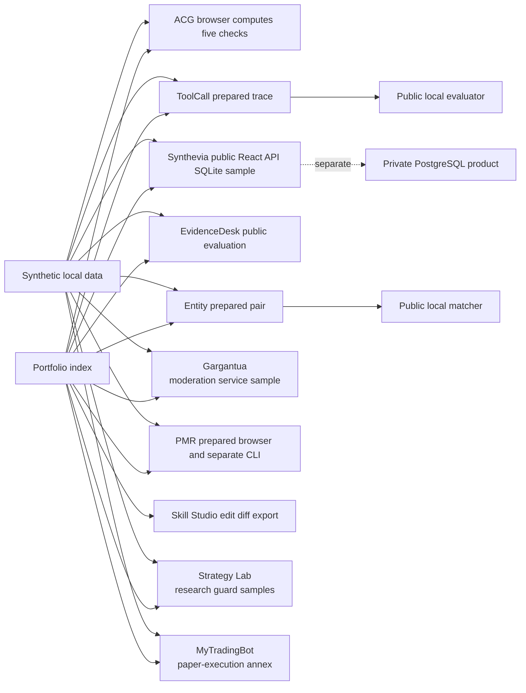

# Ardian Mehaj: Software Engineering Portfolio

I am a junior software developer based in Brussels. I work mainly with Python,
FastAPI, TypeScript, React and PostgreSQL.

Start with three inspectable problems: an API change, a rejected tool call and an ambiguous
record pair. The portfolio includes four runnable samples, a browser-computed API comparison,
prepared synthetic walkthroughs and direct paths to five separate public source repositories.

- [Browse the live portfolio](https://ardian-mehaj-portfolio.vercel.app)
- [Review the complete EvidenceDesk repository](https://github.com/LuxuriantTech/evidencedesk)
- [Review API Contract Guard](https://github.com/LuxuriantTech/api-contract-guard)
- [Review ToolCall Replay](https://github.com/LuxuriantTech/toolcall-replay)
- [Review Entity Resolution Workbench](https://github.com/LuxuriantTech/entity-resolution-workbench)
- [Review PostgreSQL Migration Rehearsal](https://github.com/LuxuriantTech/postgres-migration-rehearsal)
- [Run the full local verification](scripts/verify_all.sh)

The ToolCall, Entity and PostgreSQL repositories are clean public source snapshots
with selected runtime tests, not complete copies of their private Git histories.
Each repository declares its release scope.

## First three review paths

1. [API Contract Guard browser comparison](site/public/projects/api-contract-guard/index.html): edit two contracts, then inspect the [five rule categories](https://github.com/LuxuriantTech/api-contract-guard/blob/6ee1e569bbe751748a96e52aa0eee86864f20d69/src/engine.ts), [focused tests](https://github.com/LuxuriantTech/api-contract-guard/blob/6ee1e569bbe751748a96e52aa0eee86864f20d69/tests/rules.test.ts) and `npm ci && npm run demo` in the public repository. An empty report is bounded to the supported checks.
2. [ToolCall Replay prepared trace](site/public/projects/toolcall-replay/index.html): inspect the expected rejection, then follow the [local evaluator rules](https://github.com/LuxuriantTech/toolcall-replay/blob/0c68b24f87992099c05249e27dc16f20d39c7c79/src/toolcall_replay/rules.py), [rule tests](https://github.com/LuxuriantTech/toolcall-replay/blob/0c68b24f87992099c05249e27dc16f20d39c7c79/tests/test_rules.py) and the repository's `uv sync --frozen; scripts/lab.sh start` quick start. The browser does not execute the evaluator.
3. [Entity Resolution prepared pair](site/public/projects/entity-resolution-workbench/index.html): compare the score, engine REVIEW and session-only annotation; follow the [matcher](https://github.com/LuxuriantTech/entity-resolution-workbench/blob/adb88a9f8daff82809b2c061b52b85b70fa531b1/src/entity_resolution_workbench/matcher.py), [decision tests](https://github.com/LuxuriantTech/entity-resolution-workbench/blob/adb88a9f8daff82809b2c061b52b85b70fa531b1/tests/test_scoring_and_decisions.py) and the local start command in its README. The browser threshold changes explanation only.

## Projects

| Project | What is reviewable here | Status |
|---|---|---|
| [API Contract Guard](projects/api-contract-guard/README.md) | Dedicated TypeScript CLI repository: five bounded OpenAPI compatibility checks, local reference handling, deterministic JSON/HTML reports and a synthetic demo | Public repository; local-only tool with a defined subset, not a general compatibility verdict |
| [ToolCall Replay](site/public/projects/toolcall-replay/index.html) | Public source snapshot with local evaluator, selected runtime tests and prepared synthetic browser trace | Browser walkthrough does not run the evaluator; private history excluded |
| [Entity Resolution Workbench](site/public/projects/entity-resolution-workbench/index.html) | Public source snapshot with local matcher, selected runtime tests and prepared synthetic browser comparison | Browser threshold does not recompute an engine decision; private history excluded |
| [EvidenceDesk](projects/evidencedesk/README.md) | Dedicated full-source React/FastAPI repository and frozen v7 evaluation | Experimental local prototype; blind v7 is `HONEST_NEGATIVE` |
| [Synthevia](projects/synthevia/README.md) | React → local FastAPI → in-memory SQLite synthetic record, deterministic retrieval and focused frontend/backend tests | Private product is pre-launch; this edition is offline and not production-ready |
| [Gargantua / GLXBot](projects/gargantua/README.md) | Asynchronous moderation logic, a rejected member action, a record type without a message-content field and a local API | Historically deployed; current runtime is unverified |
| [PostgreSQL Migration Rehearsal](site/public/projects/postgres-migration-rehearsal/index.html) | Public source snapshot and a separate, current six-invoice CLI baseline; prepared browser stages | Frozen historical browser environment remains blocked by LOW02 |
| [Skill Studio](projects/skill-studio/README.md) | Static instruction editor, text diff and Markdown export | Model execution remains private; no systematic gain established |
| [Synthevia Strategy Lab](projects/strategy-lab/README.md) | Benjamini–Hochberg p-value adjustment, a compact HAC check, one-use holdout, a declared fill/position sanity gate and deterministic LLM abstention | Internal R&D; synthetic examples only |
| [MyTradingBot](projects/mytradingbot/README.md) | Additional paper-execution sample: live-mode rejection, absolute and configurable equity-relative notional limits and synthetic NO-GO qualification | Paper-only prototype; no live-readiness or profitability claim |

The bundled samples keep their own README, decisions, limitations, source and
tests. The ToolCall, Entity and PostgreSQL browser walkthroughs use prepared
synthetic data; their local applications and selected tests are in their linked
public repositories. EvidenceDesk and API Contract Guard have separate public
repositories as well.

## Project Atlas navigator

The [Project Atlas site](site/README.md) adds a single-page interface for
moving between the project summaries. It uses the same bounded claims as these
README files and links back to the reviewable source. It contains no form,
analytics, private API call or runtime secret.



## Verify the repository

Prerequisites: Python 3.12 or newer, [uv](https://docs.astral.sh/uv/), Node.js
24 and npm 11. The first installation requires package-index access.

```bash
./scripts/verify_all.sh
```

That command installs each locked dependency set, runs lint and selected tests,
runs strict type checking where configured, audits the frontend dependencies,
regenerates the four bundled synthetic demo outputs, validates the Synthevia frontend
and the Project Atlas site, then checks local Markdown links. It does not
contact a private API, exchange, Discord, Telegram, production server or real
database.

For a shorter review, open a project README and run only its documented demo.

## Boundaries of this public edition

This repository was rebuilt with a new Git history. The five linked repositories
contain the described public code; ToolCall, Entity and PostgreSQL are selected
snapshots rather than complete private histories. The four bundled samples are
small editions of larger private projects. Credentials, real
user or community data, private infrastructure, deployment configuration,
live execution paths, proprietary strategies and parameters, logs, dumps and
operational findings are excluded.

The examples demonstrate selected contracts, decisions and failure paths. They
do not prove commercial traction, current deployment, production maturity,
complete security, trading profitability or readiness to use capital.

## Development process

I use coding assistants when they are useful, but I remain responsible for the requirements,
review, tests and final publication. The examples keep failure cases and limits visible instead of
claiming results they do not prove.

## Private technical review

The complete repositories behind the four bundled samples remain private because
they include proprietary implementation and operational configuration. Five
separate public repositories expose the source described above; three of those
are bounded snapshots with selected tests and no complete private history.

## Contact

Ardian Mehaj, Brussels, Belgium  
mehajardian@gmail.com

## License

The repository is published for portfolio review under the terms in [LICENSE.md](LICENSE.md).
