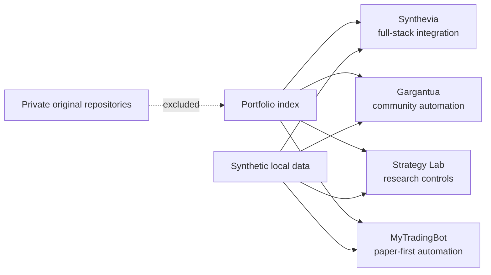

# Ardian Mehaj — Software Engineering Portfolio

Four selected software projects in one repository, with runnable synthetic
demos, focused tests and the engineering limits I would discuss in an
interview.

I am a junior software developer based in Brussels. I work mainly with Python,
FastAPI, TypeScript, React, PostgreSQL and automated testing, with an emphasis
on requirements, debugging and verification.

Planning to begin the University of London BSc Computer Science programme in
October 2026.

## Projects

| Project | What is reviewable here | Status |
|---|---|---|
| [Synthevia](projects/synthevia/README.md) | FastAPI boundaries, deterministic retrieval, synthetic workspace data and a tested React view | Private product is pre-launch; this edition is offline and not production-ready |
| [Gargantua / GLXBot](projects/gargantua/README.md) | Asynchronous moderation logic, permission failure, privacy-minimising audit records and a local API | Historically deployed; current runtime is unverified |
| [Synthevia Strategy Lab](projects/strategy-lab/README.md) | FDR, a compact HAC check, one-use holdout, PnL-realizability and deterministic LLM abstention | Internal R&D; synthetic examples only |
| [MyTradingBot](projects/mytradingbot/README.md) | Paper execution, explicit live-mode rejection, Decimal risk checks and auditable qualification | Paper-only prototype; no live-readiness or profitability claim |

Each project keeps its own README, architecture notes, decisions, limitations,
demo, selected source files and tests. They are grouped here so one link is
enough for a recruiter, but the examples remain independently runnable.



## Verify the repository

Prerequisites: Python 3.12 or newer, [uv](https://docs.astral.sh/uv/), Node.js
24 and npm 11. The first installation requires package-index access.

```bash
./scripts/verify_all.sh
```

That command installs each locked dependency set, runs lint and selected tests,
runs strict type checking where configured, regenerates the four synthetic demo
outputs, validates the Synthevia frontend and checks local Markdown links. It
does not contact a private API, exchange, Discord, Telegram, production server
or real database.

For a shorter review, open a project README and run only its documented demo.

## Boundaries of this public edition

This repository was rebuilt with a new Git history. It does not contain the
histories or complete source trees of the private projects. Credentials, real
user or community data, private infrastructure, deployment configuration,
live execution paths, proprietary strategies and parameters, logs, dumps and
operational findings are excluded.

The examples demonstrate selected contracts, decisions and failure paths. They
do not prove commercial traction, current deployment, production maturity,
complete security, trading profitability or readiness to use capital.

## How I use coding agents

I use Claude Code and Codex for exploration, implementation, review and
debugging. I define the requirements, split work into bounded tasks, inspect
the result, run the evidence and decide what is accepted. I do not claim that
every line was written manually.

The project READMEs give concrete examples: an unbounded retrieval input was
restricted in Synthevia; a permission-failure path was retained in Gargantua;
malformed LLM output must become `ABSTAIN` in Strategy Lab; and MyTradingBot
removes the live adapter instead of trusting only a runtime flag.

## Private technical review

The complete repositories remain private because they include proprietary
implementation and operational configuration. After an initial interview, I
can provide a guided walkthrough or selected additional evidence. I have not
created recruiter-access repositories as part of this publication package.

## Contact

Ardian Mehaj — Brussels, Belgium  
mehajardian@gmail.com

