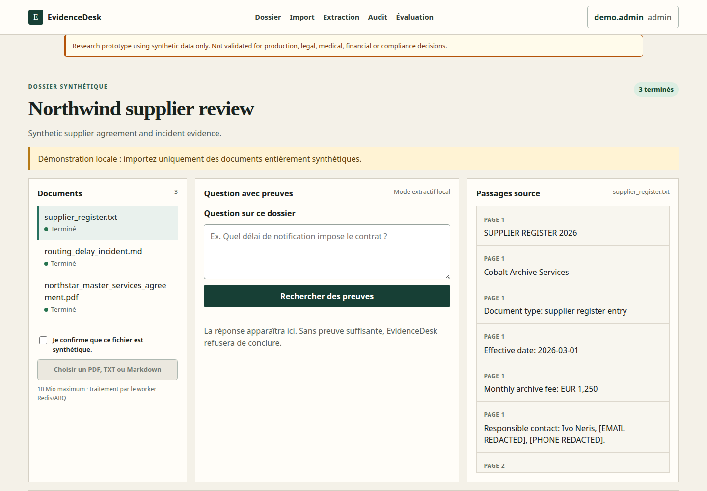
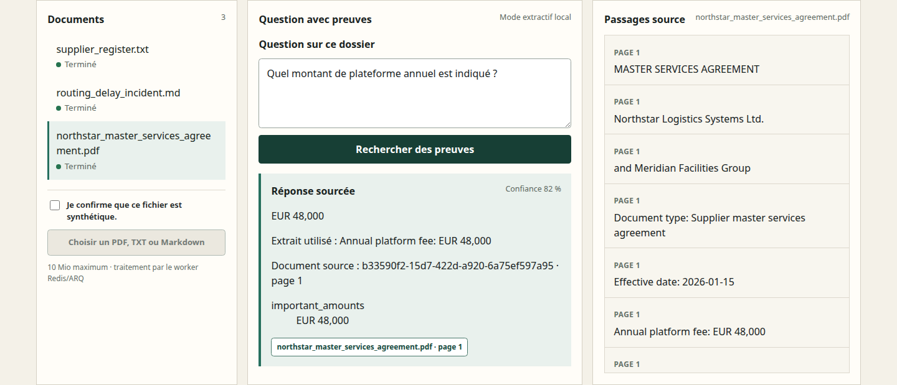

# EvidenceDesk

EvidenceDesk is an experimental, fully local document-intelligence and RAG
reliability platform for synthetic supplier files. The complete source lives in
[LuxuriantTech/evidencedesk](https://github.com/LuxuriantTech/evidencedesk); it is
linked here rather than copied into this portfolio.





## What is implemented

- React and TypeScript frontend with a FastAPI API;
- PostgreSQL/pgvector hybrid retrieval and a local CPU ONNX embedding;
- Redis/ARQ asynchronous ingestion with retries and idempotence;
- server-side RBAC, PII masking, correlated audit events and JSON logs;
- evidence-linked extractive answers, explicit abstention and structured extraction;
- Docker Compose, pytest, Vitest and Playwright on the real local stack.

No external model API is required. The active answer engine is deterministic and
extractive; EvidenceDesk does not contain a proprietary LLM.

## Blind evaluation result

The frozen v7 dataset contains 40 synthetic cases and has one recorded lock, raw
result and independent recalculation. It returned 100% Recall@5 on the 25
answerable cases, 36% answerable-case accuracy, 80% citation precision, 48%
citation recall, 80%
abstention accuracy and 45.67% extraction F1. The result is
`HONEST_NEGATIVE`: retrieval found the expected evidence, but answer selection,
citation recall and extraction did not generalise well enough.

One v7 adversarial document also caused an injected instruction to be returned.
A deterministic guard and regression tests were added after the evaluation; v7
was not rerun or rescored. This is a documented fix, not a new quality claim.

## Reproduce the checks

Clone the dedicated repository, then use its pinned dependencies:

```bash
git clone https://github.com/LuxuriantTech/evidencedesk.git
cd evidencedesk
uv sync --frozen --all-groups
uv run ruff check apps/api apps/worker evals scripts
uv run mypy
uv run pytest --cov --cov-report=term-missing
cd apps/web && npm ci && npm run lint && npm run typecheck && npm test && npm run build
```

The release commit passed 347 backend tests with 82.49% total coverage, six
frontend unit tests, and Playwright against the Docker Compose stack. The
[GitHub CI run](https://github.com/LuxuriantTech/evidencedesk/actions/runs/33133108331)
also completed its backend, frontend, secret-scan and real-stack jobs successfully.
See the [release evidence](https://github.com/LuxuriantTech/evidencedesk/blob/main/docs/release-validation.md)
and [evaluation protocol](https://github.com/LuxuriantTech/evidencedesk/blob/main/docs/evaluation.md).

## Limits

- synthetic data only; no real personal or business documents;
- not validated for production, legal, medical, financial or compliance decisions;
- blind v7 missed every quality target except retrieval and technical error rate;
- no OCR for image-only PDFs or validation under production load;
- the API image currently carries 13 unique High/Critical Debian CVEs without a
  fixed package version, so Internet deployment remains blocked;
- Codex Security Deep Scan was not run, by user decision; local tests, Gitleaks,
  dependency audits and Trivy are not equivalent to it;
- no Internet application deployment was performed for this publication.

The screenshots above were captured from the real local application and match
the hashes documented in the EvidenceDesk release evidence.
