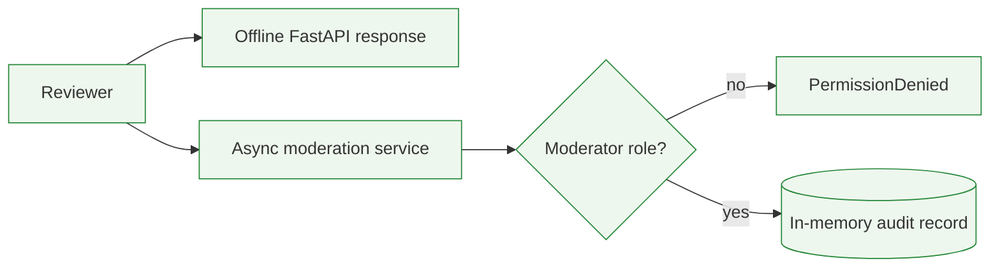

# Gargantua / GLXBot

Gargantua addresses the day-to-day needs of a Discord community: moderation,
administration and an audit trail. This offline edition reduces that larger
private system to the permission boundary I most want a reviewer to inspect,
plus a fictional FastAPI response and synthetic-data generator. It contains no
Discord bot, gateway connection, React dashboard or database.

## Public scope

The original project was deployed historically. Its current runtime was not
verified during the 20 August 2026 audit, so I do not present it as an active
service. This repository is an offline review sample, not the deployed bot and
not a production-ready release.

## Moderation boundary

The broader project grew from routine moderation and configuration work. This
sample narrows that problem to one asynchronous boundary: a non-moderator must
not create an audit action, while an allowed action records only its identifiers
and a synthetic reason.

## Included here

- an asynchronous moderation service with a role gate;
- an in-memory audit record that deliberately excludes message content;
- a read-only FastAPI dashboard response using one fictional guild;
- a reproducible guild-data generator;
- focused permission, audit and API tests;
- a dedicated CI job without Discord, a private database or Sentry.

## Kept private

Bot tokens, real guild and user identifiers, messages, tickets, sanctions,
administrative commands, the complete OAuth flow, privilege-sensitive
workflows, backups, infrastructure, monitoring configuration and original Git
history are excluded.

## Public service path

Discord, OAuth, storage and monitoring are not mocked as if they were real.
More detail is in [Architecture](docs/ARCHITECTURE.md).

## Technical stack

### Public runtime

Python, an asynchronous service, dataclasses and FastAPI.

### Storage boundary

Plain Python objects and generated JSON only. The sample has no database.

### Failure-path checks

pytest, pytest-asyncio and FastAPI TestClient.

### Local verification

The portfolio workflow runs the selected Python checks without Discord, a
private database or Sentry.

## Decisions I can defend

### Record the action, not the conversation

**Why it was made:** a moderation audit needs actor, subject, guild, reason and
action identity; copying message content would add unnecessary private data.

**Trade-offs:** a reviewer cannot reconstruct the complete conversation from
the audit record.

**Current limitation:** the sample store is in memory and does not demonstrate
retention or database concurrency.

### Keep permission checks in the service boundary

**Why it was made:** commands and web routes should not each invent their own
role rule.

**Trade-offs:** the service needs a trusted, current actor context.

**Current limitation:** this edition does not reproduce Discord OAuth or live
permission refresh.

### Avoid a fake Discord demo

**Why it was made:** a local review should not need a bot token or a real
server.

**Trade-offs:** gateway timing and Discord rate limits are out of scope.

**Current limitation:** asynchronous behaviour is demonstrated at service
level, not through the Discord network.

## Evidence

Latest verified local run: 21 August 2026, branch `main`, Python 3.12.13 and uv 0.11.7.

~~~bash
uv sync --locked --dev --no-install-project
uv run --no-sync ruff check src tests scripts
uv run --no-sync pytest -q
PYTHONPATH=src uv run --no-sync python -m gargantua_showcase.demo_data
~~~

Result: 5 tests passed; Ruff and the local Markdown-link check passed. The tests cover disabled CDN-backed docs, a rejected member action, an audited
moderator action, fictional dashboard data and generated data without message
content. This is a selected showcase suite, not the private project's full
historical test count or current deployment health.

## Review check: member-action rejection

The portfolio-wide Claude Code and Codex workflow is described in the
[portfolio README](../../README.md#how-i-use-coding-agents). Here, the review
criterion was that a member-level action fails before an audit mutation; the
accepted path records actor, subject and reason without a message-content field.

## Limits

- Current service availability is unverified.
- OAuth and permission-revocation behaviour are not part of the public sample.
- There are no real Discord users, guilds or operational metrics here.
- The in-memory store is a teaching surface, not a durability claim.
- Complete security, production readiness and user-count claims are not made.

## Run the sample

Python 3.12 or newer and uv are required.

~~~bash
uv sync --locked --dev --no-install-project
PYTHONPATH=src uv run --no-sync python -m gargantua_showcase.demo_data
PYTHONPATH=src uv run --no-sync uvicorn gargantua_showcase.api:app --host 127.0.0.1 --port 8000
~~~

Open http://127.0.0.1:8000/api/dashboard. The returned guild is fictional; the
server does not connect to Discord or write a database. Initial dependency
installation requires package-index access; the installed demo makes no
outbound request.
