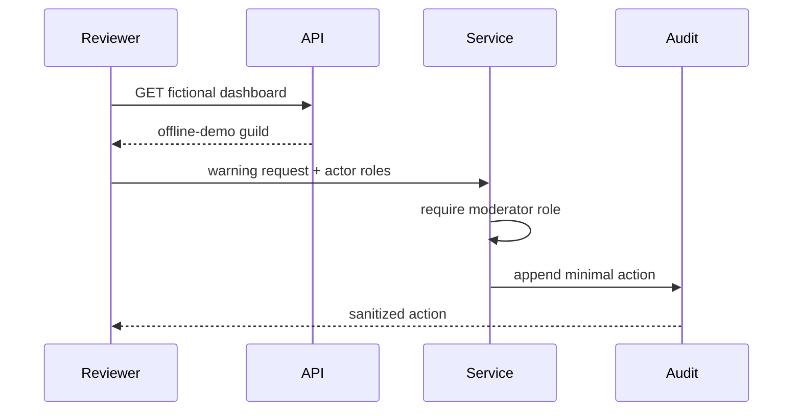

# Architecture

## Private project

The bot is organised around discord.py event and command modules. Async service
and persistence code sits behind those entry points. A separate FastAPI
dashboard handles web-facing configuration, with a React client and Discord
OAuth in the private path. PostgreSQL and SQLite support different deployment
or development contexts.

Prometheus and Sentry integrations exist in the private repository, but their
real configuration is not part of this edition.

## Public request flow

No token, gateway connection, OAuth callback, background worker or external
telemetry is reachable from the sample.
