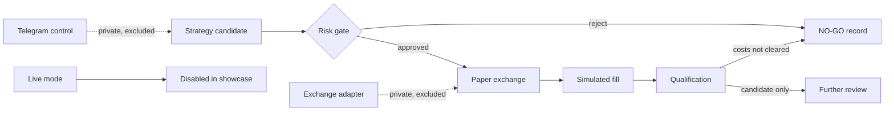

# MyTradingBot

MyTradingBot explored how far trading automation could go without crossing into
live execution. This secondary portfolio sample keeps only the paper path,
explicit live-mode rejection, absolute and configurable equity-relative
notional limits, synthetic qualification arithmetic and a read-only health
response.

## Why this is an additional sample

It is intentionally secondary to the broader software samples in this
portfolio. The private project is an advanced research prototype, not
production-ready live-trading software or evidence of profitability. This
edition removes live execution and uses synthetic values throughout.

## Why paper-first matters

Automation can turn a software defect into a financial action. I built the
prototype around a stricter sequence: generate a candidate, apply explicit risk
gates, execute through paper infrastructure, and produce a qualification
artifact that can say NO-GO.

The private project explored several engines, exchange integrations, APIs and
remote controls. My main responsibility was organising that work into
reviewable tasks, testing control boundaries and refusing to treat a large
historical test count as proof that the whole system was ready.

## Safe components included

- a paper exchange with deterministic simulated slippage;
- an explicit exception when live mode is requested;
- Decimal-based absolute and configurable equity-relative notional limits;
- a qualification report that subtracts simulated costs;
- a local health route that reports paper-only and no external calls;
- focused tests for the failure and audit paths.

## Components excluded

Exact strategies and parameters, exchange and CCXT configuration, keys, VPS and
SSH details, live routes, Telegram credentials and operational commands,
private market data, logs, local paths, original qualification archives and Git
history are not included.

## Control flow

In the public path, no node has network access or a live adapter. The API
exposes health information only. See [Architecture](docs/ARCHITECTURE.md).

## Technical stack

### Public automation boundary

Python, FastAPI and Decimal for paper-execution and notional examples.

### Evidence boundary

The private prototype includes backtest and qualification artifacts. This
edition operates on values created inside its tests and demo.

### Control checks

pytest, Ruff and mypy strict.

### Operational separation

The private project contains GitHub Actions and exchange-related operational
material. The portfolio CI job requires no user-supplied credential or private
server.

## Engineering choices

### Omit the live adapter

**Why it was made:** an environment flag is weaker than removing the capability
from a public demonstration.

**Trade-offs:** the repository cannot demonstrate real exchange behaviour.

**Current limitation:** paper fills do not model latency, partial fills or
selection effects.

### Use Decimal at the execution boundary

**Why it was made:** binary floating-point is a poor default for requested
quantity, price and notional.

**Trade-offs:** callers must convert external values deliberately.

**Current limitation:** the qualification summary still uses float for a small
synthetic basis-point example and is not an accounting ledger.

### Let qualification return NO-GO

**Why it was made:** gross behaviour that does not clear stated costs should
not become a success claim.

**Trade-offs:** the simple report cannot model an entire fee or fill schedule.

**Current limitation:** CANDIDATE means only that one arithmetic gate passed;
it does not authorize deployment or capital.

## Targeted checks

Latest verified local run — 21 August 2026, branch `main`, Python 3.12.13 and uv 0.11.7.

~~~bash
uv sync --locked --dev --no-install-project
uv run --no-sync ruff check src tests scripts
uv run --no-sync mypy src
uv run --no-sync pytest -q
PYTHONPATH=src uv run --no-sync python -m mytradingbot_showcase.qualification
~~~

Result: 10 tests passed; lint, strict type checking and the local Markdown-link
check passed. Tests cover live
mode rejection, deterministic paper fills, notional rejection, an auditable
risk decision, a NO-GO after costs and the paper-only health response.

This is a targeted green suite. It does not replace or conceal the broader
private suite, which had unresolved failures and errors in historical full-run
evidence. No private test total is presented as a general success metric.

## Run the qualification example

~~~bash
uv sync --locked --dev --no-install-project
PYTHONPATH=src uv run --no-sync python -m mytradingbot_showcase.qualification
PYTHONPATH=src uv run --no-sync uvicorn mytradingbot_showcase.api:app --host 127.0.0.1 --port 8000
~~~

The demo prints a synthetic NO-GO because 4 gross basis points do not clear 6
simulated basis points of cost. It does not contact Telegram, an exchange or a
database. Initial dependency installation requires package-index access.

## Review check: live-mode rejection

The portfolio-wide Claude Code and Codex workflow is described in the
[portfolio README](../../README.md#how-i-use-coding-agents). For this sample,
review rejected a runtime-flag-only design: there is no live adapter, and a
live-mode request must raise before any paper-fill path can run.

## Paper-execution boundary

- The paper fill model is deterministic and deliberately small.
- Risk evaluation demonstrates absolute and configurable equity-relative
  notional limits, not portfolio risk.
- The API has no strategy or order route.
- No current live readiness or stable profitability has been demonstrated.
- The complete private suite was not green in the evidence reviewed.
- Telegram, CCXT and VPS workflows are outside the public boundary.
