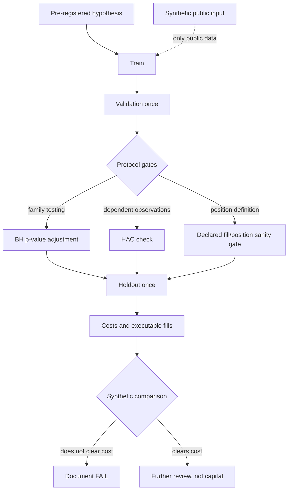

# Synthevia Strategy Lab

A small runnable sample derived from a larger internal research lab. It exposes
synthetic-data controls for strategy evaluation, typed code and reproducible
validation checks; it is not a trading product.

## Research boundary

The private project is internal R&D. It is not a trading product, not
production-ready and not evidence of profitable live trading. This portfolio
edition contains generic methodological controls only; it cannot place an
order and includes no proprietary hypothesis or parameter.

## The question behind the project

Backtests make it easy to find a convincing chart after enough trials. I built
the lab to make rejection cheaper and false confidence harder: separate
training from validation, touch the holdout once, correct families of tests,
account for serial dependence, and ask whether a real position could have
reached the reported PnL.

A negative result is useful here. If a candidate disappears after simulated
costs or fails an executability gate, recording FAIL prevents a weaker result
from becoming a claim.

## What this edition contains

- a Benjamini–Hochberg p-value adjustment;
- a small Newey–West mean standard-error calculation;
- a one-use holdout protocol;
- a declared fill/position sanity gate;
- an LLM output contract that abstains on invalid structure;
- a seeded synthetic candidate whose verdict depends on its generated gross
  value and a supplied simulated cost;
- tests and strict type checking.

## Deliberate exclusions

Exact strategies, optimised parameters, private hypotheses, exchange
credentials, proprietary datasets, database routes, order routing, mainnet
paths and real performance results are absent. The original Git history is not
carried over.

## Method flow

The public functions represent a few gates from that workflow. They are not a
complete statistical research library. See [Architecture](docs/ARCHITECTURE.md).

## Technical stack

### Research code

Python 3.12 or newer with strict typing.

### Private data stack

The private lab uses NumPy, Polars, SciPy, statsmodels, scikit-learn,
PostgreSQL and SQLite. This edition uses generated Python values only.

### Quality gates

pytest, Ruff and mypy strict.

### Reproducibility

A uv lockfile and a dedicated GitHub Actions job. No tunnel, remote database
or exchange is involved.

## Three research decisions

### Consume holdout once

**Why it was made:** repeated inspection turns unseen data into another tuning
set.

**Trade-offs:** mistakes discovered after consumption cannot be silently
retested on the same observations.

**Current limitation:** the public guard is in-memory; the private workflow
needs durable research records to enforce this across processes.

### Reject unreachable PnL before statistical interpretation

**Why it was made:** a price series can move without offering a fill that a
fixed position could capture.

**Trade-offs:** this removes attractive results and requires more detailed
execution assumptions.

**Current limitation:** the example checks declared properties; it does not
simulate an order book.

### Make invalid LLM output abstain

**Why it was made:** prose or an unknown decision should never pass a research
gate accidentally.

**Trade-offs:** potentially useful but malformed output is discarded.

**Current limitation:** the public contract validates two fields, not factual
correctness of a model's reason.

## Verified checks

Latest local run — 21 August 2026, branch `main`, Python 3.12.13 and uv 0.11.7.

~~~bash
uv sync --locked --dev --no-install-project
uv run --no-sync ruff check src tests scripts
uv run --no-sync mypy src
uv run --no-sync pytest -q
PYTHONPATH=src uv run --no-sync python -m strategy_lab_showcase.demo
~~~

Result: 9 tests passed; lint, strict type checking and the local Markdown-link
check passed. The seeded demo compares a generated synthetic gross value with a
supplied simulated cost and emits `FAIL` or `PASS`. This result covers only the
selected public functions; it is not a validation of a strategy, a return
metric or the private research corpus.

## Review check: abstention contract

The portfolio-wide Claude Code and Codex workflow is described in the
[portfolio README](../../README.md#how-i-use-coding-agents). Here, malformed
LLM output must become `ABSTAIN`, never an inferred approval; the synthetic
candidate verdict is a separate conditional comparison, not a market result.

## Known limitations

- The statistics functions are compact examples, not replacements for vetted
  scientific libraries.
- No power calculation or full walk-forward engine is included.
- Synthetic observations cannot establish market behaviour.
- The one-use holdout guard is process-local.
- No result here supports profitability, capital allocation or live readiness.

## Run the falsification demo

~~~bash
uv sync --locked --dev --no-install-project
PYTHONPATH=src uv run --no-sync python -m strategy_lab_showcase.demo
~~~

The command uses a fixed seed, makes no network request and prints one
synthetic conditional verdict. It cannot access a wallet, venue or real
database.
Initial dependency installation requires package-index access.
