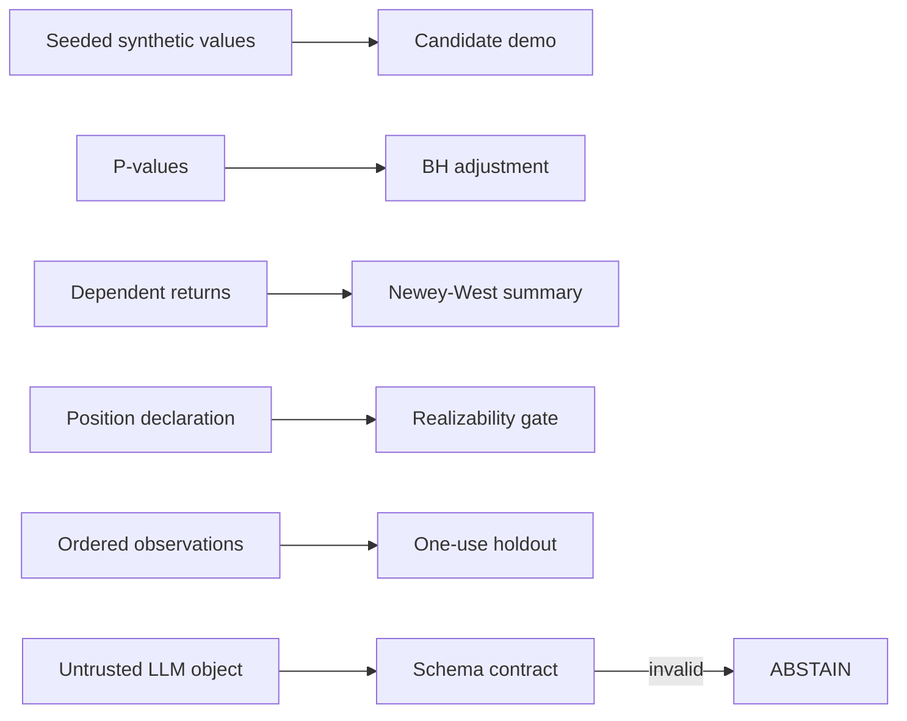

# Research architecture

The private lab separates protocol, data access, statistical analysis, search
campaigns, execution modelling and research records. Read-only database access
and paper collectors support investigations, but their configuration and data
are outside this repository.

The public package has no I/O except the demo's JSON output to stdout:

The components are intentionally independent so a reviewer can challenge one
assumption without running a research campaign.
