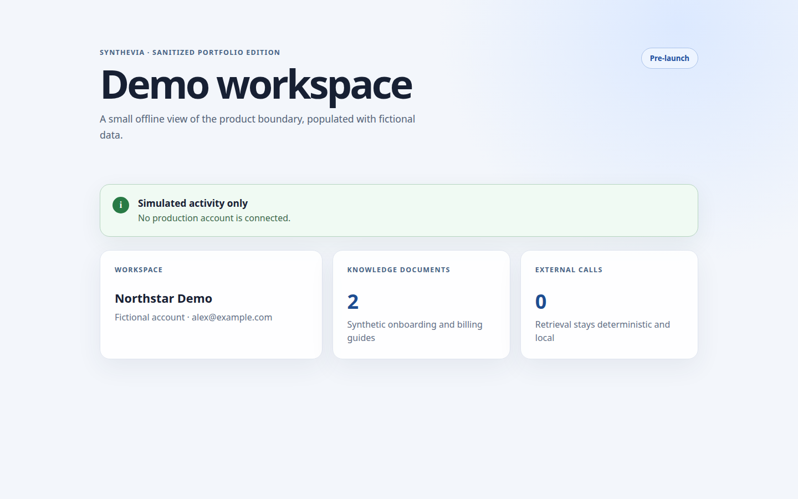
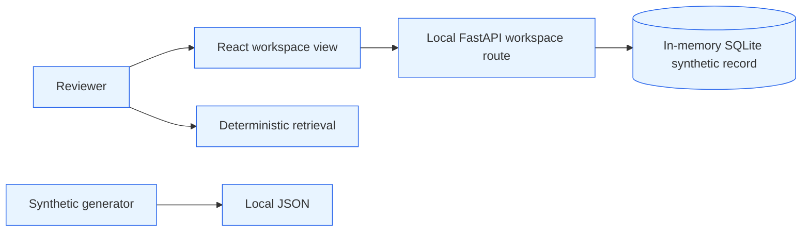

# Synthevia

The private Synthevia product brings account, document and research workflows
into one interface. This public edition keeps one path that a reviewer can run
end to end: a React view loads a synthetic workspace through local FastAPI and
in-memory SQLite. Deterministic retrieval and data generation remain separate,
smaller examples.

## Scope of this sample

The private product is pre-launch. This repository is a small, independently
rebuilt portfolio edition: it is offline by default, paper-only where financial
examples appear, and not production-ready. Current deployment state was not
verified during the 20 August 2026 portfolio audit.

## Why this sample exists

Synthevia started as a single workspace for account management, subscription
flows, document retrieval and research tools. The hard part was not adding one
more API integration. It was keeping authentication, persistence, background
work and a TypeScript interface understandable as the scope grew.

This public sample isolates a few reviewable boundaries rather than attempting
to reproduce the private application's integrations.

## What is included

- a React workspace view that loads one local API contract;
- a FastAPI endpoint backed by an in-memory SQLite synthetic record;
- two read-only FastAPI responses that disclose the demo boundary;
- deterministic retrieval over two fictional documents;
- a synthetic workspace-data generator;
- a separate React component that labels simulated activity;
- focused Python and frontend tests;
- a CI workflow with lint, tests, type checking, link checking and secret scan.

## What is not included

The original history, database models, migrations, private infrastructure,
authentication implementation, payment and OAuth configuration, production
endpoints, customer data, financial data, exchange adapters and research
parameters remain private. No credential or real account is required here.

## Public paths

The workspace path is entirely local: Vite proxies `/api` to FastAPI, and
FastAPI reads a generated record from in-memory SQLite. It is not a connection
to the private PostgreSQL, authentication or provider paths.

The private project contains other components, but they are not reproduced here.
See [the architecture notes](docs/ARCHITECTURE.md) for the precise boundary.

## Technical stack

### Public code

Python, FastAPI, in-memory SQLite, deterministic retrieval and a React/TypeScript
view.

### Data boundary

The public workspace route uses generated data in an in-memory SQLite database;
retrieval uses caller-supplied in-memory documents. PostgreSQL, service
integrations and providers are not part of this sample.

### Verification

pytest, Vitest, Testing Library and TypeScript type checking.

### Local verification

The portfolio workflow gives this edition dedicated Python and frontend jobs.

## Engineering decisions

### Keep the public edition offline

**Why it was made:** a recruiter can run the relevant path without receiving a
credential or touching a private service.

**Trade-offs:** mocks do not demonstrate provider behaviour or operational
latency.

**Current limitation:** the demo proves component contracts, not the complete
integration.

### Make simulated state visible in the interface and API

**Why it was made:** paper-only results should not be mistaken for real account
activity.

**Trade-offs:** the repeated label is intentionally more explicit than a normal
product screen.

**Current limitation:** there is no end-to-end browser build in this small
edition; the selected component is tested in isolation.

### Use deterministic retrieval for the example

**Why it was made:** the result can be tested without an embedding API or hidden
model dependency.

**Trade-offs:** token overlap is not a substitute for semantic retrieval.

**Current limitation:** this example demonstrates ranking boundaries, not RAG
quality.

## Testing and evidence

Latest verified local run — 21 August 2026, branch `main`, Python 3.12.13 and uv 0.11.7.

~~~bash
uv sync --locked --dev --no-install-project
uv run --no-sync ruff check src tests scripts
uv run --no-sync pytest -q
cd frontend
npm ci
npm test
npm run typecheck
npm run build
~~~

Result: the Python suite reported 9 passed; the frontend suite reported one
test file and 4 tests passed. Ruff, the local Markdown-link check, frontend
type checking and the Vite build completed successfully.
The scope is this sanitized repository only. It says nothing about the complete
private suite, current deployment health or security of the original product.
Full commands and limits are recorded in
[Testing and evidence](docs/TESTING_AND_EVIDENCE.md).

## Review check: bounded retrieval

The portfolio-wide Claude Code and Codex workflow is described in the
[portfolio README](../../README.md#how-i-use-coding-agents). For this sample,
adversarial review found an unbounded document iterable; the public helper now
rejects oversized queries, documents and collections, with a test that verifies
consumption stops at the validation boundary.

## Known limitations

- The product is pre-launch and has no commercial traction claim.
- No current production runtime was verified for this audit.
- The selected retrieval example is deliberately smaller than the private RAG
  workflow.
- Open remediation and dependency work in the private code is not exposed here
  and prevents direct publication of that repository.
- No profitability, scale or complete-security claim is made.

## Running the demo

Python 3.12 or newer, uv, Node.js and npm are required.

~~~bash
uv sync --locked --dev --no-install-project
PYTHONPATH=src uv run --no-sync python -m synthevia_showcase.demo_data
PYTHONPATH=src uv run --no-sync uvicorn synthevia_showcase.api:app --host 127.0.0.1 --port 8000
~~~

In another terminal:

~~~bash
cd frontend
npm ci
npm run dev
~~~

Open the local Vite URL printed by the command. The frontend proxies `/api` to
the local FastAPI process and renders only the synthetic SQLite record. The
generator writes fictional JSON under `demo/synthetic_data`; no private or
external service is contacted. Initial dependency installation requires
package-index access.
