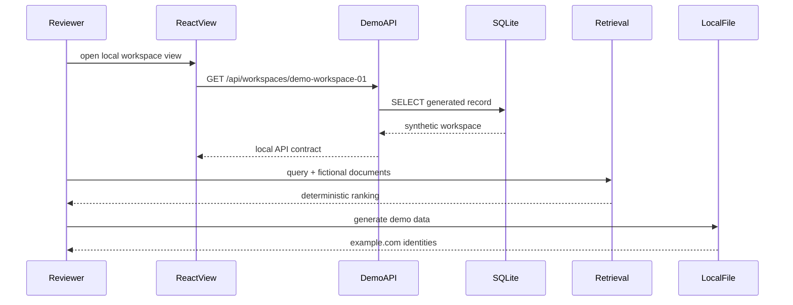

# Architecture

## Private system boundary

The verified codebase separates a React/TypeScript client from FastAPI routes
and service modules. PostgreSQL is used through SQLAlchemy and Alembic; Redis
supports short-lived state, and pgvector is used in retrieval-related paths.
OAuth, payment and other providers sit behind service boundaries.

This description is intentionally logical. Hosts, private routes, environment
names and deployment topology are excluded.

## Public edition

The public API has two read-only status routes and one workspace route. The
workspace route reads a generated record from in-memory SQLite; the React sample
loads it through the local `/api` Vite proxy. Retrieval accepts caller-supplied
fictional documents, and the generator writes one local JSON file.

There is no route from this edition to a production database, payment service,
OAuth provider or trading venue.
